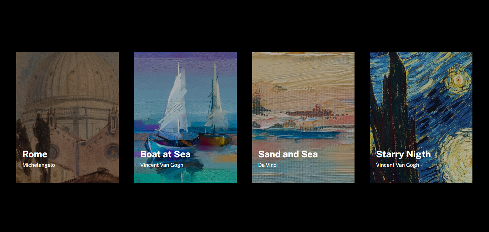
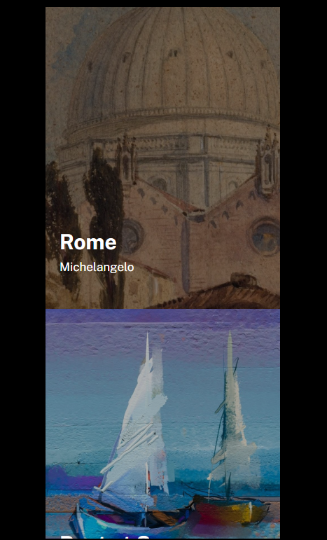

# Lista De Pinturas 🖼️

Um projeto que fiz para práticar meu HTML e CSS, esse exercicío foi tirado do curso Dev Quest onde a atividade proposta era fazer uma lista de quadros famosos, coloquei estilos a mais como a animação quando passa o mouse em cima

## Screenshot 
Desktop 💻
[]

Mobile 📱
[]

## Tecnologias utilizadas 👨‍💻
- HTML
- CSS